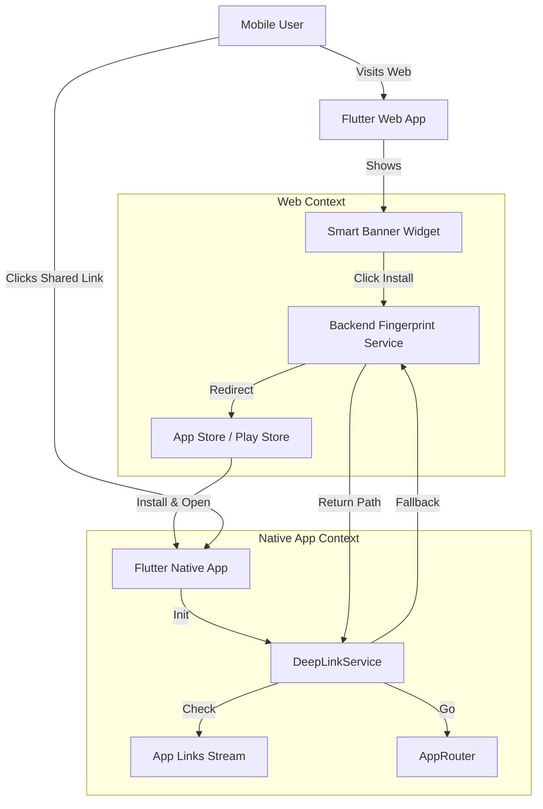

# Specifications: Deep Linking & Smart Banner

> Version: 1.0
> Status: DRAFT
> Last Updated: 2026-01-30
> Requirements: [01-requirements.md](./01-requirements.md)

## Overview
Реализация системы Deep Linking обеспечивает бесшовный переход пользователей из Web-версии приложения в нативное мобильное приложение. Включает в себя Smart Banner для конверсии Web-пользователей в установки приложения и механизм отложенного диплинкинга (Deferred Deep Linking) для сохранения контекста навигации после установки.

## Affected Systems

| System | Impact | Notes |
|--------|--------|-------|
| `lib/main.dart` | Modify | Инициализация `DeepLinkService` и `dotenv`. |
| `lib/core/navigation/app_router.dart` | Modify | Настройка обработки внешних путей. |
| `lib/features/deeplink/` | Create | Новый модуль для логики диплинков. |
| `android/app/src/main/AndroidManifest.xml` | Modify | Добавление `intent-filter` для App Links. |
| `ios/Runner/` | Modify | Настройка Universal Links (Entitlements, Info.plist). |
| `web/` | Modify | Добавление конфигурации для Web-Smart Banner (если требуется JS-вставка) или реализация внутри Flutter Web. |

## Architecture

### Component Diagram



## Interfaces

### DeepLinkService

```dart
abstract class IDeepLinkService {
  /// Инициализация прослушивания входящих ссылок
  Future<void> init();
  
  /// Поток входящих ссылок (для обработки во время работы приложения)
  Stream<Uri> get uriLinkStream;
  
  /// Проверка отложенного диплинка (при первом запуске)
  Future<String?> checkDeferredLink();
  
  /// Генерация ссылки для шеринга
  String generateShareLink(String path);
}
```

### Backend Contract (Fingerprint Service)
*Предполагаемый контракт для реализации Fingerprint-мэтчинга (реализуется на стороне API Gateway/Backend, здесь только клиентская часть)*

**POST /api/v1/deeplink/register**
Request:
```json
{
  "fingerprint": "hash_string", // IP + UA + ScreenRes + OS
  "path": "/property/AZ/Maricopa/123",
  "ttl": 3600 // seconds
}
```
Response: `200 OK`

**POST /api/v1/deeplink/match**
Request:
```json
{
  "fingerprint": "hash_string"
}
```
Response:
```json
{
  "path": "/property/AZ/Maricopa/123" // or null if not found
}
```

## Data Models

### EnvConfig (Configuration)
Класс-обертка над `flutter_dotenv`.

```dart
class EnvConfig {
  static String get webDomain => dotenv.env['WEB_DOMAIN'] ?? '';
  static String get iosBundleId => dotenv.env['IOS_BUNDLE_ID'] ?? '';
  static String get androidPackageName => dotenv.env['ANDROID_PACKAGE_NAME'] ?? '';
  
  // Stores
  static String get storeGooglePlay => dotenv.env['STORE_GOOGLE_PLAY'] ?? '';
  static String get storeApple => dotenv.env['STORE_APPLE'] ?? '';
  static String get storeHuawei => dotenv.env['STORE_HUAWEI'] ?? '';
  // ... others
}
```

## Behavior Specifications

### 1. Smart Banner (Web Only)
**Logic:**
1.  Check `kIsWeb`. If false, return `SizedBox.shrink()`.
2.  Detect OS (Android/iOS) via `defaultTargetPlatform` or `User-Agent`.
3.  If Android:
    *   Detect Manufacturer (via `User-Agent` regex if possible, fallback to Google Play).
    *   Prioritize: Huawei -> Samsung -> Xiaomi -> RuStore -> Google Play (based on availability in `.env` and detection). *Correction: Req says Google Play #1 priority.*
    *   Show banner with "Install" button linked to Store URL.
4.  If iOS:
    *   Show banner linked to Apple App Store.
5.  **Click Action:**
    *   Generate Fingerprint (Client-side simple hash).
    *   Call `register` API with current route path.
    *   Redirect to Store URL.

### 2. Direct Deep Link (App Installed)
**Logic:**
1.  User clicks `https://deal.taxlien.online/property/AZ/Maricopa/123`.
2.  OS intercepts via Universal Link / App Link.
3.  App opens.
4.  `app_links` package catches the intent.
5.  `DeepLinkService` extracts path `/property/AZ/Maricopa/123`.
6.  `AppRouter` navigates to valid route.

### 3. Deferred Deep Link (App Not Installed)
**Logic:**
1.  User installs and opens app.
2.  `DeepLinkService` initializes.
3.  Checks `SharedPreferences` flag `has_checked_deferred`. If true, skip.
4.  If false:
    *   Generate Fingerprint.
    *   Call `match` API.
    *   If path returned -> `AppRouter.go(path)`.
    *   Set `has_checked_deferred = true`.

## Dependencies

### Pubspec.yaml
- `app_links`: ^3.4.0 (Handling Universal/App Links)
- `device_info_plus`: ^9.0.0 (Device detection)
- `package_info_plus`: ^5.0.0 (Version info)
- `flutter_dotenv`: (Existing)

### External
- **Backend API**: Требуется эндпоинт для fingerprint matching (или заглушка на первое время). *Note: В рамках этого flow реализуем только клиентскую часть и мок-сервис.*

## Integration Points

### GoRouter
Интеграция через `GoRouter` не требует специальных изменений для `app_links`, так как `GoRouter` может быть сконфигурирован на прослушивание внешних событий, либо мы будем императивно вызывать `router.go` из сервиса.
*Решение:* Используем императивный вызов `router.go` при получении события от `DeepLinkService`, чтобы иметь полный контроль (особенно для Deferred сценария).

## Testing Strategy

### Unit Tests
- `EnvConfig`: парсинг переменных, фоллбэки.
- `DeepLinkService`: мок `app_links`, проверка логики вызова API при deferred link.

### Manual Verification
1.  **Web:** Открыть сайт в Chrome Device Mode (Android/iPhone). Проверить появление баннера и правильность ссылки стора.
2.  **Android:** Скомпилировать с `assetlinks.json` (на хосте). Проверить клик по ссылке из заметок/email -> открытие приложения.
3.  **iOS:** Аналогично с `apple-app-site-association`.

## Open Design Questions
- **Backend Fingerprinting:** Кто реализует серверную часть?
    *   *Decision:* В рамках этого task делаем простой Mock-сервис локально или используем `localStorage` (если пользователь возвращается в браузер), но согласно требованиям реализуем логику под API. Если API нет, фоллбэк на "открываем Home".

---

## Approval
- [ ] Reviewed by: Anton
- [ ] Approved on: [Date]
